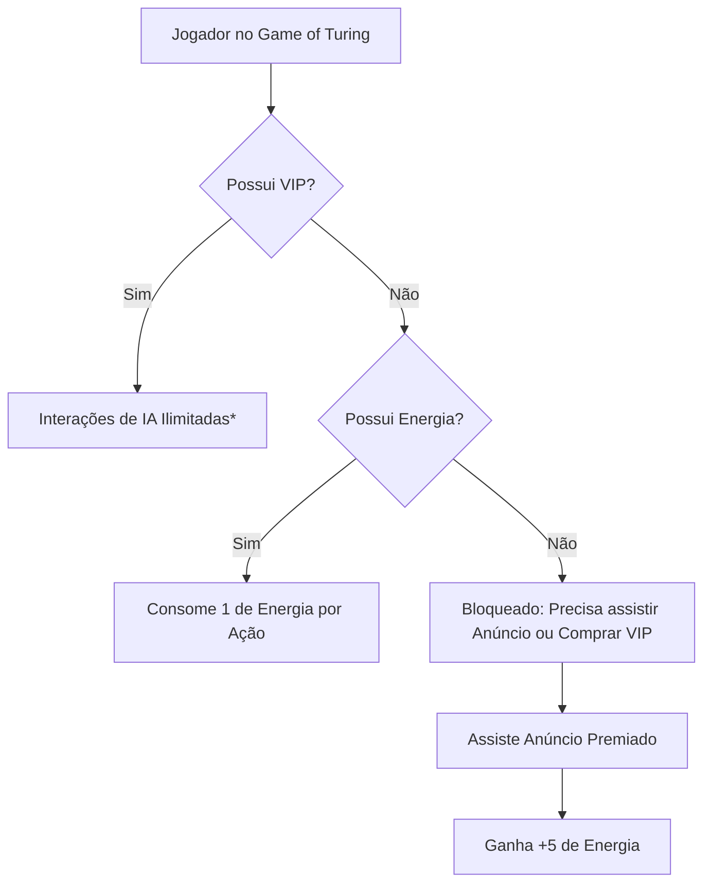
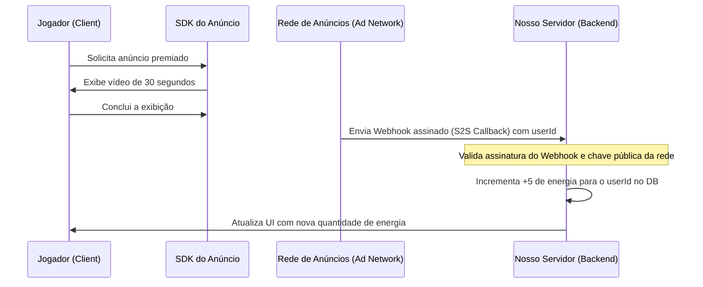

# Estratégia e Implementação de Monetização Híbrida

Este documento detalha o planejamento arquitetural e técnico para a implementação do sistema de monetização híbrida do **Game of Turing**. O objetivo principal é neutralizar o custo marginal de chamadas de API (DeepSeek-V4-Flash) por usuário gratuito, garantindo lucratividade e escalabilidade sem desequilibrar o ecossistema do jogo (*freemium* justo).

---

## 1. Visão Geral do Modelo Híbrido

O modelo é composto por três pilares fundamentais:



1. **Conta Gratuita com Limite de Energia:**
   - O jogador recebe uma cota de **20 de energia diária** (resetada a cada 24 horas).
   - Cada ação de IA no jogo (mensagem enviada que demanda processamento de LLM) consome **1 de energia**.
2. **Anúncios Premiados (Rewarded Ads) para Recarga:**
   - Ao esgotar a energia, o jogador pode assistir a um vídeo de anúncio premiado de 30 segundos em troca de **+5 de energia**.
   - O retorno médio por visualização de anúncio (eCPM) no Brasil cobre com folga (mais de 20x) o custo de processamento da API da DeepSeek por essas 5 mensagens.
3. **Assinatura VIP (R$ 4,90/mês):**
   - Remove totalmente os anúncios.
   - Concede acesso ilimitado de IA (com proteção sob uma política de uso justo/fair use).
   - Benefícios cosméticos no quarto ou no chat.

---

## 2. Modelagem do Banco de Dados (Supabase/PostgreSQL)

Para gerenciar o estado financeiro e de consumo de cada usuário, a tabela `users` (ou uma nova tabela `billing_profiles`) precisa ser atualizada.

```sql
-- Extensão opcional ou campos adicionais na tabela users
ALTER TABLE users ADD COLUMN is_vip BOOLEAN DEFAULT FALSE;
ALTER TABLE users ADD COLUMN vip_expires_at TIMESTAMP WITH TIME ZONE;
ALTER TABLE users ADD COLUMN energy_balance INTEGER DEFAULT 20;
ALTER TABLE users ADD COLUMN last_energy_reset_at TIMESTAMP WITH TIME ZONE DEFAULT NOW();

-- Indexação para consultas rápidas
CREATE INDEX idx_users_vip ON users(is_vip, vip_expires_at);
```

### Regra de Proteção (Triggers)

Para garantir consistência e evitar manipulação de energia por injeção direta no client-side:

```sql
-- Trigger para impedir energia negativa
ALTER TABLE users ADD CONSTRAINT check_positive_energy CHECK (energy_balance >= 0);
```

---

## 3. Implementação do Sistema de Energia

A validação de energia **deve ser executada estritamente no servidor (Server-Side)**, especificamente no Next.js API Routes ou Supabase Edge Functions que gerenciam o envio de mensagens do jogo.

### Algoritmo de Validação de Energia (API do Jogo)

Ao tentar enviar uma mensagem em uma partida ativa:

1. **Verificar VIP:** O servidor consulta `is_vip` e `vip_expires_at`.
   - Se for VIP ativo (`is_vip = true` e `vip_expires_at > NOW()`), a ação é **liberada**.
2. **Verificar Energia:**
   - Se o usuário não for VIP, o servidor consulta o `energy_balance`.
   - Se `energy_balance > 0`, decrementa o valor em 1 e prossegue com a requisição de IA.
   - Se `energy_balance = 0`, retorna erro HTTP `403 Forbidden` com payload `{"error": "OUT_OF_ENERGY"}`.

### Reset Diário de Energia

Para evitar rotinas pesadas de cron job atualizando milhares de linhas simultaneamente à meia-noite, utiliza-se a técnica de **Lazy Reset** (Reset por Demanda).

Quando o usuário faz login ou abre o painel do jogo:
1. O backend compara `last_energy_reset_at` com o dia atual.
2. Se a diferença for de mais de 24 horas (ou se o dia do calendário mudou):
   - Atualiza `energy_balance = 20` (ou o valor padrão atual).
   - Atualiza `last_energy_reset_at = NOW()`.

---

## 4. Integração de Anúncios Premiados (Rewarded Ads)

Para monetização Web e Mobile, a arquitetura deve integrar redes de anúncios que suportem **Server-to-Server (S2S) Callback Verification** (Verificação de Recompensa via Servidor) para evitar trapaças onde o jogador forja o envio da conclusão do anúncio.

### Redes Sugeridas para Web/Mobile
- **AdMob (Google):** Padrão de indústria para aplicativos e Web Mobile.
- **AppLovin / Unity Ads:** Excelentes taxas de preenchimento e eCPM para jogos.
- **CrazyGames SDK / Poki SDK:** Se o jogo for distribuído em portais de jogos Web.

### Fluxo de Validação Segura do Anúncio (S2S Callback)



#### Exemplo de Rota de Webhook para Receber Recompensa (`/api/ads/reward`)

```typescript
import { NextRequest, NextResponse } from 'next/server';
import { supabaseAdmin } from '@/lib/supabase-admin';
import crypto from 'crypto';

export async function GET(req: NextRequest) {
  const { searchParams } = new URL(req.url);
  const userId = searchParams.get('user_id');
  const signature = searchParams.get('signature'); // Assinatura provida pela rede de anúncios
  
  // 1. Validar assinatura S2S (exemplo simplificado da AdMob)
  const isValid = verifyAdMobSignature(searchParams, signature);
  if (!isValid) {
    return NextResponse.json({ error: 'Assinatura inválida' }, { status: 400 });
  }

  // 2. Creditar a energia com segurança
  const { data, error } = await supabaseAdmin.rpc('increment_user_energy', {
    target_user_id: userId,
    energy_amount: 5
  });

  if (error) {
    return NextResponse.json({ error: 'Erro ao creditar energia' }, { status: 500 });
  }

  return NextResponse.json({ success: true, new_balance: data });
}

function verifyAdMobSignature(params: URLSearchParams, signature: string | null): boolean {
  // Implementação da criptografia verificando contra a chave pública do provedor de anúncios
  return true; 
}
```

---

## 5. Implementação da Assinatura VIP (R$ 4,90/mês)

A assinatura é baseada em pagamentos recorrentes facilitados por gateways com excelente suporte a Pix e Cartão no Brasil.

### Gateways Sugeridos
- **Stripe:** Melhor documentação e integração global. Fácil gerenciamento de assinaturas recorrentes com portal do cliente pronto.
- **Mercado Pago / Asaas / Pagar.me:** Gateways nacionais com taxas altamente competitivas para recebimento de Pix e boleto.

### Fluxo de Compra e Webhooks

1. O jogador clica em "Assinar VIP (R$ 4,90)" no frontend.
2. O backend cria uma sessão de checkout no gateway de pagamento e retorna o link de pagamento.
3. O jogador conclui o pagamento.
4. O gateway envia um evento (Webhook) `checkout.session.completed` ou `invoice.payment_succeeded` para o nosso backend.
5. O backend processa o webhook e atualiza o banco de dados.

#### Webhook de Pagamento (`/api/webhooks/payment`)

```typescript
import { NextRequest, NextResponse } from 'next/server';
import { supabaseAdmin } from '@/lib/supabase-admin';
import stripe from '@/lib/stripe'; // Instância do SDK do Stripe

export async function POST(req: NextRequest) {
  const body = await req.text();
  const signature = req.headers.get('stripe-signature') as string;

  let event;
  try {
    event = stripe.webhooks.constructEvent(body, signature, process.env.STRIPE_WEBHOOK_SECRET!);
  } catch (err) {
    return NextResponse.json({ error: 'Webhook inválido' }, { status: 400 });
  }

  if (event.type === 'invoice.payment_succeeded') {
    const session = event.data.object as any;
    const customerEmail = session.customer_email;
    const expiresAt = new Date();
    expiresAt.setMonth(expiresAt.getMonth() + 1); // Renovação de 30 dias

    // Atualiza status do jogador para VIP no Supabase
    await supabaseAdmin
      .from('users')
      .update({
        is_vip: true,
        vip_expires_at: expiresAt.toISOString()
      })
      .eq('email', customerEmail);
  }

  return NextResponse.json({ received: true });
}
```

---

## 6. Política de Uso Justo (Fair Use) e Proteção

Mesmo que o jogador VIP possua "IA Ilimitada", é necessário implementar um **limite de segurança lógico** para mitigar riscos de prejuízos causados por:
- Jogadores automatizando robôs/bots para jogar 24/7 na conta VIP.
- Tentativas de *reverse-engineering* da API do jogo para usar o modelo da DeepSeek gratuitamente em outros projetos.

### Medidas de Segurança:
1. **Rate Limiting no Backend:**
   - VIPs possuem um limite de no máximo 120 mensagens por hora.
   - Qualquer request que exceda essa cota recebe um bloqueio temporário de 1 hora.
2. **Cap de Custos Físicos:**
   - Se o consumo mensal de um único usuário VIP passar de 1,5 milhão de tokens, a conta é suspensa temporariamente para análise antifraude. (Esse volume equivale a centenas de partidas e excede de longe o comportamento de um ser humano comum).
